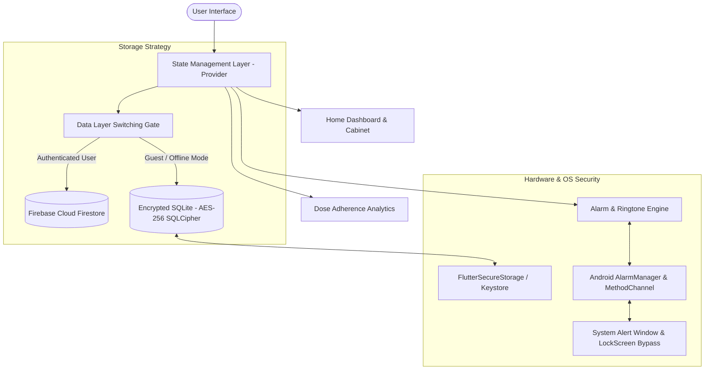
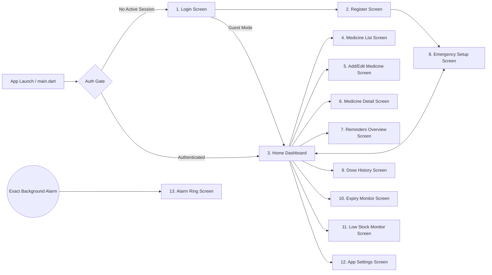
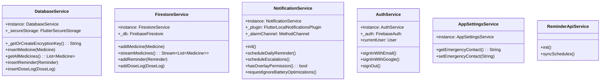
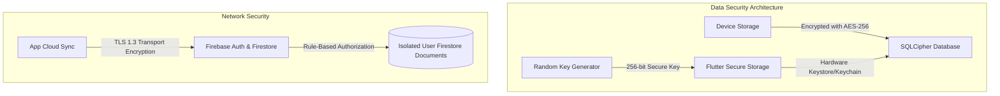
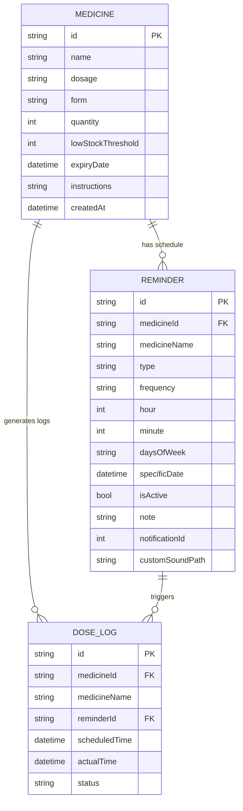

# Smart Medicine Cabinet — Technical Architecture & Product Specification Report

**Document Version:** 1.0.0  
**Project Name:** MyMedicine (`smart_medicine_cabinet` / `med_reminder`)  
**Target Platform:** Android  
**Core Framework:** Flutter 3.3+ (Dart 3.3.0 - 4.0.0)  
**Security Standard:** AES-256 SQLCipher Encryption at Rest, OS Keystore Key Storage, OAuth 2.0 Auth, Local-First Isolation  

---

## 1. Executive Summary & Architectural Overview

The **MyMedicine** application is an enterprise-grade,  medication management, expiry and stock tracking, and critical alarm system built using Flutter and Dart. Designed for high reliability, privacy compliance, and real-time medical alert delivery, the application bridges local hardware capabilities (hardware-backed secure storage, exact background timers, lock-screen overlay alarms) with optional but preferred cloud-synchronized persistence (Firebase Auth & Cloud Firestore).

### Architecture Principles:
1. **Offline-First & Local Sovereignty:** Operates fully without network access using a local AES-256 encrypted SQLite database managed by SQLCipher.
2. **Dual-Tier Data Sync:** Dynamically switches between encrypted local storage (Guest session) and cloud synchronization (Firebase Cloud Firestore) based on authentication state without UI interruption.
3. **Fail-Safe Alarm Engine:** Integrates native Android `AlarmManager` method channels alongside `flutter_local_notifications` to guarantee alarm triggers even under aggressive OS battery optimization (`exactAllowWhileIdle`).

---

## 2. Screen-by-Screen Deep Dive

The application comprises **13 distinct user interfaces**, each engineered with modular widget breakdown, reactive state management, and strict access controls.

---

### Screen 1: Login Screen (`login_screen.dart`)
* **Primary Purpose:** Serves as the authentication gateway providing user identity verification, guest mode entrance, and password recovery.
* **Key Features:**
  * Email and Password input validation with regex formatting checks.
  * Integration with Firebase Authentication (`signInWithEmailAndPassword`).
  * One-tap Google Sign-In (`google_sign_in` OAuth 2.0 flow).
  * Guest Mode bypass: allows instant usage of local-only encrypted SQLite storage without creating an account.
  * Forgot Password dialog triggering asynchronous password reset emails.
* **State & Dependencies:** `AuthService`, `ThemeProvider`, `TextEditingController`, `FormState`.
* **Security Control:** Password visibility toggle.

---

### Screen 2: Register Screen (`register_screen.dart`)
* **Primary Purpose:** Enables new user account creation and automated profile initialization.
* **Key Features:**
  * Multi-field registration form (Name, Email, Password, Confirm Password).
  * Real-time password strength meter checking length, uppercase, lowercase, numeric, and special characters.
  * Automated user document creation in Cloud Firestore upon successful sign-up.
  * Immediate error handling for  email-already-in-use, or network timeouts.
* **State & Dependencies:** `AuthService`, `FirestoreService`, custom regex validators.
* **Security Control:** Password visibility toggle; Password strength(how easy to breach)
---

### Screen 3: Home Dashboard Screen (`home_screen.dart`)
* **Primary Purpose:** Central command center summarizing daily compliance, upcoming doses, and system health.
* **Key Features:**
  * **Today's Timeline:** Chronologically ordered list of scheduled doses for the current day.
  * **System Alert Banners:** Instant notification counters for Low Stock items and Expiring Medicines.
  * **Emergency Action Card:** Quick button for manual look up all existing details of a feature.
  * **Navigation Drawer / Bottom Bar:** Seamless access to Cabinet, History, Reminders, and Settings.
* **State & Dependencies:** `MedicineProvider`, `ReminderProvider`, `DoseLogProvider`.

---

### Screen 4: Cabinet / Medicine List Screen (`medicine_list_screen.dart`)
* **Primary Purpose:** Inventory management view listing all medications stored in the cabinet.
* **Key Features:**
  * Live search bar filtering by medicine name or instructions.
  * Status badges: Highlighting expired items, low stock warnings, or inactive schedules.
  * Floating Action Button (FAB) to trigger creation of new medication entries.
* **State & Dependencies:** `MedicineProvider`.

---

### Screen 5: Add / Edit Medicine Screen (`add_edit_medicine_screen.dart`)
* **Primary Purpose:** Form interface for entering or updating medication metadata.
* **Key Features:**
  * Form fields: Name, Dosage strength (e.g., 500mg), Form selection drop-down, Total Stock Quantity, Low-Stock Alert Threshold (default: 5 units).
  * Date Picker for Expiry Date with validation forbidding past dates for new stock.
  * Special intake instructions text box (e.g., "Take after meals with water").
  * Dual-mode operation: Dynamically pre-fills existing data when invoked in Edit mode.
* **State & Dependencies:** `MedicineProvider`, `ReminderProvider`, `FormState`.

---

### Screen 6: Medicine Detail Screen (`medicine_detail_screen.dart`)
* **Primary Purpose:** In-depth inspection view for a single medication entity.
* **Key Features:**
  * Complete metadata overview (Form icon, Dosage, Expiry date countdown, Instruction notes).
  * Active Reminder Schedules attached specifically to this medication.
  * Inventory Refill / Stock Adjustment button (+/- quick adjustments).
  * Action items: Edit medication specs or Delete medication (cascades deletion to attached reminders).
* **State & Dependencies:** `MedicineProvider`, `ReminderProvider`, `DoseLogProvider`.

---

### Screen 7: Reminders Overview Screen (`reminders_screen.dart`)
* **Primary Purpose:** Management panel for configuring active, pending, and custom alarm schedules.
* **Key Features:**
  * List view of all scheduled reminders with information like daily, specific weekday, or one-time events.
  * Active toggle switch enabling or disabling reminders on the fly without deleting the configuration.
  * Custom Ringtone selector: Opens OS file picker (`file_picker`) to assign custom audio files to individual reminders.
  * Quick-add reminder launcher linking medication selection to specific time pickers.
* **State & Dependencies:** `ReminderProvider`, `NotificationService`.

---

### Screen 8: Alarm Ring Screen (`alarm_ring_screen.dart`)
* **Primary Purpose:** Critical full-screen intent alert screen triggered when a medicine reminder time arrives.
* **Key Features:**
  * **Lock-Screen Bypass:** Overlays above lock screen and system UI using native Android `SYSTEM_ALERT_WINDOW` flags.
  * **Looping Audio Playback:** Plays custom MP3 ringtones via `audioplayers`.
  * **Primary Actions:**
    1. **TAKE DOSE:** Automatically decrements medicine quantity by 1, creates a `DoseLog` marked `taken`, stops audio, and dismisses the alarm.
    2. **SNOOZE:** Schedules a 5 or 10-minute temporary escalation reminder.
    3. **NOT TAKEN DOSE:** Logged as `skipped` in historical adherence stats.
  * **Emergency Contact Call:** Info containing name and phone number in case of emergency.
* **State & Dependencies:** `NotificationService`, `DoseLogProvider`, `MedicineProvider`, `audioplayers`.

---

### Screen 9: Emergency Contact & Escalation Setup Screen (`emergency_contact_setup_screen.dart`)
* **Primary Purpose:** Configuration setup for missed-dose caregiver escalation protocols.
* **Key Features:**
  * Emergency contact input form (Contact Name, Phone Number).
  * Escalation delay timer setup (e.g.,repeat if dose unacknowledged ).`AppSettingsService`, `url_launcher`.

---

### Screen 10: Dose Adherence History Screen (`dose_history_screen.dart`)
* **Primary Purpose:** Analytical log of past dosage activity for medical reporting.
* **Key Features:**
  * Date range selector to view historical compliance records during doctor visits.
* **State & Dependencies:** `DoseLogProvider`.

---

### Screen 11: Expiry Tracking Screen (`expiry_screen.dart`)
* **Primary Purpose:** Focused safety view monitoring expiring soon or expired cabinet contents.
* **Key Features:**
  * Three-tiered categorization:
    1. **Expired:** Highlighted in red; immediate removal advisory.
    2. **Expiring Soon:** Highlighted in amber; expiry within 30 days.
    3. **Safe Stock:** Highlighted in green.
* **State & Dependencies:** `MedicineProvider`.

---

### Screen 12: Low Stock Monitor Screen (`low_stock_screen.dart`)
* **Primary Purpose:** Supply-chain refill dashboard preventing unexpected medication stockouts.
* **Key Features:**
  * Lists medications where `quantity <= lowStockThreshold`.
* **State & Dependencies:** `MedicineProvider`.

---

### Screen 13: App Settings Screen (`settings_screen.dart`)
* **Primary Purpose:** System preferences, theme management.
* **Key Features:**
  * Theme switcher: Light or Dark (`ThemeProvider`).
  * Account & Storage summary: Indicates whether using Cloud Sync (Firestore) or Encrypted Local Storage (SQLCipher).
  * Battery optimization guide dialog for Xiaomi, Samsung, and Huawei devices.
  * System Notification Permission tester.
  * Logout / Data Wipe triggers.
* **State & Dependencies:** `ThemeProvider`, `AppSettingsService`, `AuthService`.

---

## 3. Services & Core Engine Architecture

---

### Service 1: `DatabaseService` (`database_service.dart`)
* **Role:** Local Data Access Object (DAO) for guest mode and offline backup using **SQLCipher AES-256**.
* **Key Implementation Details:**
  * Hardware key management: Generates a cryptographically secure 256-bit (64 hex character) random key using `Random.secure()`.
  * Secure Storage Integration: Persists key in OS-protected hardware space via `FlutterSecureStorage` (Android EncryptedSharedPreferences / Keystore, iOS Keychain).
  * Self-Healing Mechanism: Automatically recreates database tables if key mismatch or database corruption occurs.
  * Database Schemas: Manages `medicines`, `reminders`, and `dose_logs` SQL tables.

---

### Service 2: `FirestoreService` (`firestore_service.dart`)
* **Role:** Cloud database sync engine for authenticated users.
* **Key Implementation Details:**
  * Manages Firestore collections rooted under user IDs: `users/{uid}/medicines`, `users/{uid}/reminders`, and `users/{uid}/dose_logs`.
  * Implements offline persistence enabled by default in `FirebaseFirestore`.
  * Realtime Data Streams: Exposes `Stream<List<T>>` for reactive UI updates across multiple logged-in devices.

---

### Service 3: `NotificationService` (`notification_service.dart`)
* **Role:** Low-level alarm scheduler and background notification system controller.
* **Key Implementation Details:**
  * Uses `flutter_local_notifications` combined with custom Android `MethodChannel` (`com.example.med_reminder/alarm`).
  * Native System Permissions:
    * `SCHEDULE_EXACT_ALARM` via `AndroidScheduleMode.exactAllowWhileIdle`.
    * `SYSTEM_ALERT_WINDOW` for full-screen display over locked screens.
    * `REQUEST_IGNORE_BATTERY_OPTIMIZATIONS` for preventing Doze-mode alarms suppression.

---

### Service 4: `AuthService` (`auth_service.dart`)
* **Role:** Identity provider abstraction layer wrapping Firebase Auth and Google Sign-In APIs.
* **Key Implementation Details:**
  * Listens to `authStateChanges` stream to instantly update global application state.
  * Handles credential exchange for OAuth 2.0 Google Tokens (`GoogleAuthProvider.credential`).
  * Manages clean state teardown during logout (wiping in-memory Provider caches).

---

### Service 5: `AppSettingsService` (`app_settings_service.dart`)
* **Role:** Synchronous/asynchronous app settings and configuration persistence using `SharedPreferences`.
* **Key Implementation Details:**
  * Stores non-sensitive preferences: emergency contact details, notification sound preferences, theme mode indices, and escalation delay choices.

---

### Service 6: `ReminderApiService` (`reminder_api_service.dart`)
* **Role:** Background helper service responsible for periodic schedule recalculation and notification queue audits.

---

## 4. Dependencies & Package Architecture Analysis (`pubspec.yaml`)

| Package Name | Version Lock | Architectural Role & Justification |
| :--- | :--- | :--- |
| `flutter` | SDK | Framework UI toolkit foundation. |
| `provider` | `^6.1.2` | Pragmatic state management implementing reactive `ChangeNotifier` design patterns. |
| `sqflite_sqlcipher` | `^3.4.1` | Embedded SQLite database compiled with 256-bit AES cipher algorithms. |
| `flutter_secure_storage` | `^9.2.2` | Access hardware Keystore/Keychain for encryption key storage. |
| `flutter_local_notifications` | `^17.2.1` | Native Android/iOS notification tray and full-screen intent engine. |
| `timezone` / `flutter_timezone` | `^0.9.4` / `^3.0.1` | Exact local time conversion handling daylight saving time (DST) shifts. |
| `audioplayers` | `^6.1.0` | High-decibel audio looping engine for alarm screen alerts. |
| `file_picker` | `^8.1.2` | OS file explorer interface allowing users to import custom MP3 ringtones. |
| `firebase_core` | `^4.13.0` | Initializer for Firebase SDKs. |
| `firebase_auth` | `^6.5.7` | User authentication, token handling, and session state streams. |
| `cloud_firestore` | `6.8.0` | NoSQL document cloud database with automatic offline caching. |
| `google_sign_in` | `^6.2.2` | Native OAuth 2.0 Google Sign-In SDK integration. |
| `intl` | `^0.19.0` | Internationalization, date formatting, and local timestamp parsing. |
| `uuid` | `^4.4.0` | RFC4122 compliant UUID generator for unique database entity IDs. |

---

## 5. Security, Cryptography & Privacy Architecture

1. **At-Rest Storage Encryption:**
   * All local SQLite tables are encrypted with **AES-256-CBC** using SQLCipher.
   * The cipher key is never hardcoded. It is generated at runtime using `Random.secure()`, producing 256 bits of entropy stored inside OS hardware modules (Android Keystore / iOS Keychain).
2. **Cloud Security & Rule Isolation:**
   * Firestore database rules enforce strict user-level isolation (`request.auth.uid == userId`). No user can read or write another user's medical records.
3. **Android Platform Security Declarations (`AndroidManifest.xml`):**
   * Permissions declared:
     * `<uses-permission android:name="android.permission.RECEIVE_BOOT_COMPLETED"/>` (Re-schedules alarms after phone reboot).
     * `<uses-permission android:name="android.permission.SCHEDULE_EXACT_ALARM"/>` (Exact time alarm delivery).
     * `<uses-permission android:name="android.permission.SYSTEM_ALERT_WINDOW"/>` (Full-screen overlay over lock screen).
     * `<uses-permission android:name="android.permission.REQUEST_IGNORE_BATTERY_OPTIMIZATIONS"/>` (Bypasses OS battery throttling).

---

## 6. Data Models & Database Schemas

### Entity Relationship Diagram (ERD)

---

### Database Schema Field Specifications

#### Table: `medicines`
| Column Name | SQL Data Type | Description |
| :--- | :--- | :--- |
| `id` | `TEXT PRIMARY KEY` | UUID v4 unique identifier. |
| `name` | `TEXT NOT NULL` | Trade or generic name of medication. |
| `dosage` | `TEXT` | Strength specification (e.g. `500mg`, `10ml`). |
| `form` | `TEXT` | Form factor (`Pill`, `Syrup`, `Injection`, etc.). |
| `quantity` | `INTEGER` | Current available unit count. |
| `lowStockThreshold` | `INTEGER` | Quantity trigger for low stock alert (default: `5`). |
| `expiryDate` | `TEXT` | Expiration date formatted |
| `instructions` | `TEXT` | Patient intake guidance notes. |
| `createdAt` | `TEXT` | Creation timestamp. |

#### Table: `reminders`
| Column Name | SQL Data Type | Description |
| :--- | :--- | :--- |
| `id` | `TEXT PRIMARY KEY` | UUID v4 identifier. |
| `medicineId` | `TEXT` | Foreign key referencing `medicines(id)`. |
| `medicineName` | `TEXT` | Denormalized medicine name for fast UI display. |
| `type` | `TEXT` | Enumeration: `dose`, `refill`, `expiry`. |
| `frequency` | `TEXT` | Enumeration: `daily`, `specificDays`, `once`. |
| `hour` | `INTEGER` | 24-hour scheduled hour (`0-23`). |
| `minute` | `INTEGER` | Scheduled minute (`0-59`). |
| `daysOfWeek` | `TEXT` | Comma-separated weekday integers (`1=Mon ... 7=Sun`). |
| `specificDate` | `TEXT` |  String for single-occurrence alerts. |
| `isActive` | `INTEGER` | Boolean flag (`1` for active, `0` for inactive). |
| `note` | `TEXT` | Additional reminder note. |
| `notificationId` | `INTEGER` | 32-bit unique integer hash for native AlarmManager. |
| `customSoundPath` | `TEXT` | Local file path to custom MP3 alarm ringtone. |

#### Table: `dose_logs`
| Column Name | SQL Data Type | Description |
| :--- | :--- | :--- |
| `id` | `TEXT PRIMARY KEY` | UUID v4 identifier. |
| `medicineId` | `TEXT` | Foreign key referencing `medicines(id)`. |
| `medicineName` | `TEXT` | Denormalized medicine name. |
| `reminderId` | `TEXT` | Foreign key referencing `reminders(id)`. |
| `scheduledTime` | `TEXT` | Expected intake time. |
| `actualTime` | `TEXT` | Actual action time . |
| `status` | `TEXT` | Status outcome: `taken`, `missed`, `skipped`. |

---